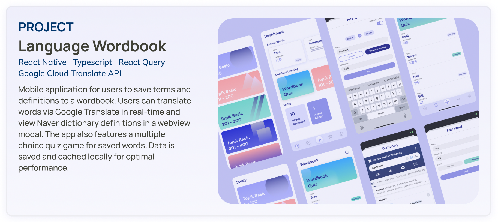
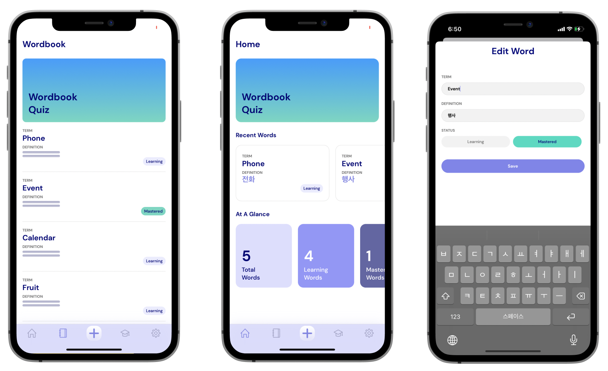
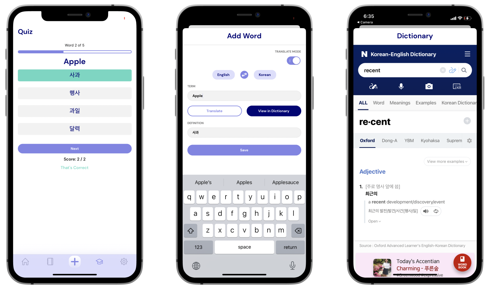

# daneo-language-wordbook
Language learning mobile application to save and learn new words. Built with <b>React Native</b>.

The language wordbook mobile application was built with the <b>Expo React Native</b> framework. The React Navigation routes users to the different screens of the application. The React Native Async Storage package is used to store data locally on the device. The same data is then cached in a global state with React Query to be used fluidly throughout the app. 

When users enter words into the ‘add word’ form page, the word data is immediately accessible for use in other components throughout the app. A function call to a Google Translate API endpoint allows for real-time translation of inputted words. 

The quiz feature of the application utlizises an array shuffle function to dynamically generate and render word questions and answer choices. React’s useMemo hook allows for efficient memoization of component wordbook data.

